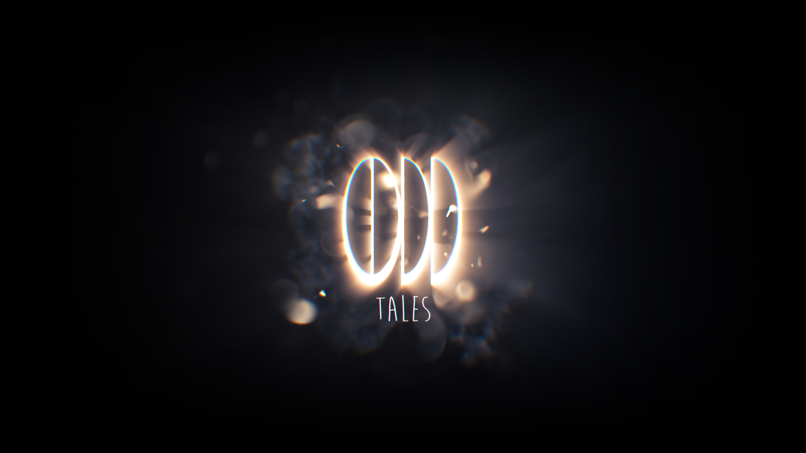
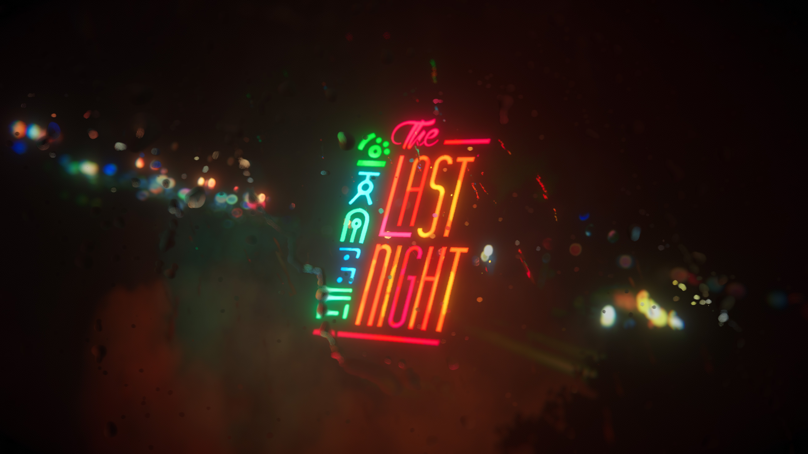

## Hello you...
Welcome to the official github for Odd Tales, the creative studio behind the awaited game "The Last Night."

## About Us
Odd Tales is a small, remote-first independent studio based in London. We specialize in creating unique, atmospheric games that explore the intersection of technology & humanity and the trajectory of civilization. Our goal is to push the boundaries off the medium, to elevate pop culture with new, meaningful and truthful angles for underserved thematics, and to tell stories that resonate with players long after the credits have rolled.

## Games
Our flagship game, "The Last Night," is a 2.5D cinematic platformer set in a science fiction world. Players take on the role of Charlie, a man living in a time when humanity has automated every single aspect of life, to the point that there is very little work remaining for humans. The game was revealed in 2017 and received widespread critical acclaim, and has been on preproduction since.

## Publications
We're looking to publish some of our findings & technology here for you to use.

If you'd like to stay up-to-date on our latest projects, follow us on [Twitter](https://twitter.com/oddtalesgames?lang=en).

Thanks for your interest in Odd Tales!
